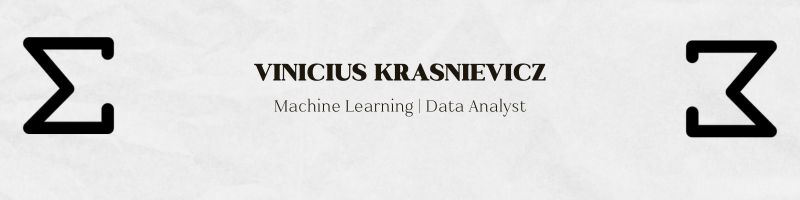

# Vinícius Krasnievicz

Mathematician (UFR, 2023) and Machine Learning specialist passionate about solving complex problems with data and code. I work with Python, Rust, and JavaScript to build scalable, innovative solutions.

## About Me
- 🌍 Rondonópolis, Brazil
- ✉️ [vinicius@vinikra.com](mailto:vinicius@vinikra.com)
- 🔗 [LinkedIn](https://linkedin.com/in/vinikra) | [GitHub](https://github.com/vinikra) | [Website](https://vinikra.com)

I'm a mathematician turned developer with a focus on Machine Learning and data analysis. I love leveraging mathematical logic and modern tools to create real-world impact, like my cryptocurrency arbitrage system, SteadyPulse.

## Projects
- **[SteadyPulse](https://www.bybit.com/copyTrade/trade-center/detail?leaderMark=ON4MQBiq027SR+ZNzGZ58Q==)**  
  A high-performance cryptocurrency arbitrage system built with Python and Rust, achieving an average monthly profitability of 12%. Integrates real-time exchange APIs and optimized algorithms.  
  *[Learn More](https://github.com/Vinikra/SteadyPulse)*

- **Machine Learning Models**  
  Predictive models developed using scikit-learn, featuring t-SNE for dimensionality reduction and KNeighborsClassifier for classification tasks. Includes exploratory data analysis with pandas and NumPy.  
  *[Check the Code](https://github.com/Vinikra/ml_portfolio)*

## Stats
  

## Skills
- **Machine Learning & Data Analysis**: scikit-learn, pandas, NumPy, t-SNE, KNeighborsClassifier, cross-validation
- **Programming**: Python (ML-focused), Rust (performance optimization), JavaScript (asynchronous)
- **Tools**: Git, GitHub, VS Code, Matplotlib

## Contact
Interested in collaborating or just want to chat about tech? Reach out via [LinkedIn](https://linkedin.com/in/vinikra) or email me at [vinicius@vinikra.com](mailto:vinicius@vinikra.com). Let's build something amazing together!
